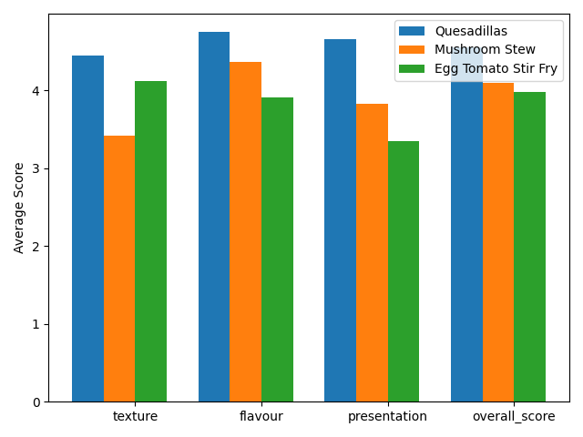

# Results

### Overall Comparisons

### Most Polarizing Dish (by metric)

**Texture:** Mushroom Stew

**Flavour:** Egg Tomato Stir Fry

**Presentation:** Egg Tomato Stir Fry

**Overall Score:** Egg Tomato Stir Fry

### Who cooked this?

Guess accuracy by dish:

**Egg Tomato Stir Fry:** 43.8% correct

**Mushroom Stew:** 50.0% correct

**Gourmet Quesadillas:** 93.8% correct

### Comments

Gourmet Quesadillas comments:

- yummy
- I was hungry
- SO GOOD
- :)
- Thank you I missed dinner!
- y
- Amazing!! Everyone killed it! Katherine
- perfect no notes
- spicy
- Love the spice
- chicken slightly dry but at least u know it is cooked
- !!!! <3 <3 <3
- cheese :) taco

Mushroom Stew comments:

- mushrooms :(
- Surprisingly tasty for me not liking mushrooms
- I don't like mushrooms :(
- It's not your fault I don't like mushrooms
- n
- Amazing!! Everyone killed it! Katherine
- perfect no notes
- I don't like mushrooms
- mushrooms auto win
- boo stews
- Flavor was off.
- I don't like mushrooms so take that into consideration
- soup :( weeee

Egg Tomato Stir Fry comments:

- rice :)
- Just rice, kinda disappointing
- :)
- it's rice.
- m
- Amazing!! Everyone killed it! Katherine
- perfect no notes
- hard to eat
- Too big tomato pieces
- No like tomato >:( blehhh
